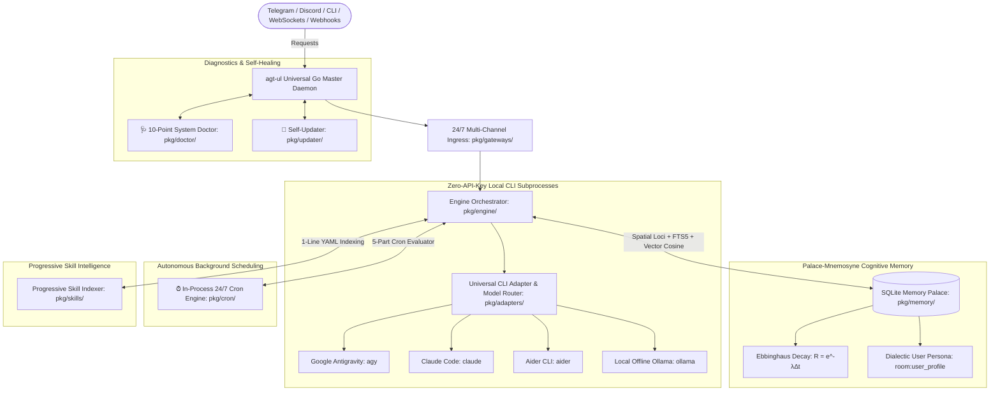

# ⚡ Agent-Unleashed (`agt-ul`)

<div align="center">

[](https://golang.org)
[](LICENSE)
[](https://agent.subimpact.net)
[](https://agent.subimpact.net)
[](https://agent.subimpact.net)
[-success)](https://agent.subimpact.net)

**The Universal 24/7 Agent Gateway & Cognitive Operating System (Written in Pure Go)**

[Website](https://agent.subimpact.net) &bull; [Quickstart](#-quickstart--installation) &bull; [Architecture](docs/ARCHITECTURE.md) &bull; [Memory Palace](docs/MEMORY_PALACE.md) &bull; [CLI Adapters](docs/CLI_ADAPTERS.md) &bull; [Gateways](docs/GATEWAYS.md) &bull; [Cron Engine](docs/CRON_AUTOMATIONS.md)

</div>

---

`agent-unleashed` (`agt-ul`) turns **any local AI CLI tool** (Google Antigravity `agy`, Claude Code `claude`, `aider`, `ollama`, or Cloud APIs) into a 24/7 autonomous, self-learning daemon with a persistent **Palace-Mnemosyne cognitive memory engine**, **in-process cron automations**, and **live context telemetry**.

---

## 🏛️ System Architecture



---

## 🌟 Core Superpowers

1. **🔌 Universal Pluggable CLI Adapters:** Multiplexes `agy`, `claude`, `aider`, `ollama`, and cloud APIs with zero API key billing. Switch drivers on the fly via `:driver <name>`. See [CLI Adapters Guide](docs/CLI_ADAPTERS.md).
2. **🏛️ Palace-Mnemosyne Cognitive Memory:** Spatial method-of-loci hierarchy (Wings $\rightarrow$ Rooms $\rightarrow$ Drawers) + Ebbinghaus temporal decay ($R = e^{-\lambda \Delta t}$) + FTS5 vector hybrid RAG. See [Memory Palace Guide](docs/MEMORY_PALACE.md).
3. **⏰ In-Process 24/7 Cron Engine:** Native Goroutine scheduler for recurring unattended tasks with SQLite persistence. See [Cron Automations Guide](docs/CRON_AUTOMATIONS.md).
4. **📊 Live Context Dashboard & Verbose Telemetry:** Real-time bottom console bar tracking input tokens, thinking tokens, cache read rates, and latency per turn (`:context`, `:verbose`).
5. **🌐 24/7 Multi-Channel Gateways:** Real-time WebSocket streaming (`ws://localhost:8080/ws`), Telegram Bot (with inline approval buttons), Discord DM pair programming, and REST APIs. See [Gateways Guide](docs/GATEWAYS.md).
6. **🩺 System Doctor & Diagnostics:** 10-point system health audit (`agt-ul doctor`) and auto-remediation (`agt-ul doctor --fix`). See [Doctor & Updater Guide](docs/DOCTOR_AND_UPDATER.md).
7. **⚡ Built-In Skill Package Manager:** Install specialized skills directly from GitHub (`agt-ul skill install Leonxlnx/taste-skill`). See [Skills & Plugins Guide](docs/SKILLS_AND_PLUGINS.md).

---

## 🚀 Quickstart & Installation

### Windows (PowerShell)
```powershell
irm https://agent.subimpact.net/install.ps1 | iex
```

### macOS / Linux / Termux
```bash
curl -fsSL https://agent.subimpact.net/install.sh | bash
```

### Build from Source
```bash
git clone https://github.com/subimpact/agent-unleashed.git
cd agent-unleashed
go build -o agt-ul.exe .
```

---

## 📖 Command Reference

### CLI Subcommands
| Command | Action |
| :--- | :--- |
| **`agt-ul`** | Launch interactive REPL & 24/7 background daemon |
| **`agt-ul -v`** | Launch in Verbose debug mode |
| **`agt-ul update`** | Self-update and recompile binary from source |
| **`agt-ul doctor`** | Run 10-point system health check & diagnostics |
| **`agt-ul doctor --fix`** | Run diagnostics and auto-repair missing folders/configs |
| **`agt-ul skill install <repo>`** | Install skill from GitHub (e.g. `Leonxlnx/taste-skill`) |
| **`agt-ul skills`** | List all discovered specialized skills |
| **`agt-ul setup`** | Run interactive configuration wizard |
| **`agt-ul status`** | Display detected CLI tools & system diagnostics |
| **`agt-ul memory`** | Inspect Palace-Mnemosyne memory stats |
| **`agt-ul cron`** | List active background scheduled tasks |
| **`agt-ul version`** | Display version and build info |

### Interactive REPL Shortcuts
| Command | Action |
| :--- | :--- |
| **`:doctor`** | Run system diagnostics |
| **`:update`** | Trigger self-updater |
| **`:context`** | Visual context window gauge & token breakdown |
| **`:verbose`** | Toggle verbose mode on/off |
| **`:profile`** | View dialectic user persona & coding profile |
| **`:cron`** | Manage background cron tasks (`:cron list`, `:cron add`, `:cron remove`) |
| **`:stats`** | View session execution diagnostics and token metrics |
| **`:drivers`** | List all detected AI CLI tools |
| **`:driver <name>`** | Switch active driver (e.g. `:driver agy`, `:driver claude`) |
| **`:memory`** | Browse Palace-Mnemosyne memory drawers |
| **`:skills`** | List learned skill runbooks |
| **`:clear`** | Clear terminal screen |
| **`:exit`** | Exit CLI |

---

## 📊 Architectural Benchmark

| Feature / Dimension | ⚡ Agent-Unleashed (`agt-ul`) | 🌐 OpenClaw | 🧠 Hermes Agent | 🤖 Aider |
| :--- | :--- | :--- | :--- | :--- |
| **Language & Footprint** | **Pure Go (&lt;15MB RAM)** | Node.js (~150MB) | Python (~200MB) | Python (~180MB) |
| **Local CLI Multiplexing** | **✅ agy, claude, aider, ollama** | ❌ API Keys Only | ❌ API / vLLM only | ⚠️ Single-CLI |
| **Cognitive Long-Term Memory** | **✅ Palace-Mnemosyne + Decay** | Basic Vector Store | ✅ Honcho Dialectic | ❌ Git Session only |
| **Live Context Telemetry Bar** | **✅ Live Bar + :context Meter** | ❌ None | ❌ Logs only | Basic summary |
| **In-Process 24/7 Cron** | **✅ SQLite-Backed 5-Part Cron** | ✅ External cron | ✅ Agent cron | ❌ Interactive only |
| **Diagnostics & Self-Healing** | **✅ agt-ul doctor & update** | Basic status | ✅ hermes doctor | ❌ None |

---

## 📚 Detailed Documentation

* [🏗️ System Architecture](docs/ARCHITECTURE.md)
* [🏛️ Palace-Mnemosyne Memory Engine](docs/MEMORY_PALACE.md)
* [🔌 Universal CLI Adapters](docs/CLI_ADAPTERS.md)
* [🌐 Multi-Channel Gateways & WebSockets](docs/GATEWAYS.md)
* [⏰ In-Process Autonomous Cron Engine](docs/CRON_AUTOMATIONS.md)
* [⚡ Progressive Skill Engine & Package Manager](docs/SKILLS_AND_PLUGINS.md)
* [🩺 System Doctor & Self-Updater](docs/DOCTOR_AND_UPDATER.md)

---

## 📄 License

MIT License &copy; 2026 subimpact.net
