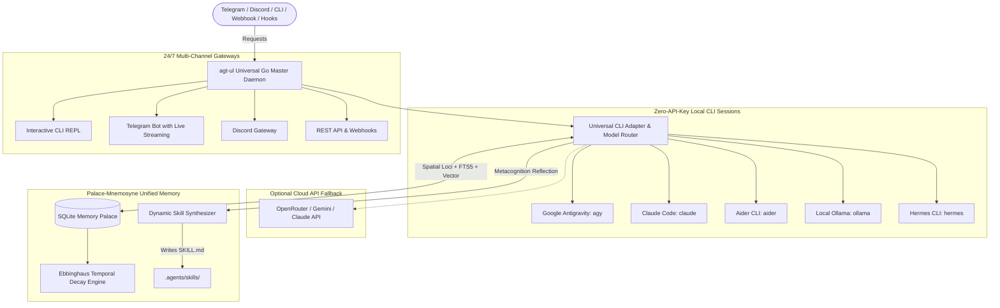

# 🚀 Agent-Unleashed (`agt-ul`)

> **The Universal 24/7 Agent Meta-Harness & Gateway Operating System (Written in Pure Go)**

`agent-unleashed` (`agt-ul`) turns **any local AI CLI tool** (Google Antigravity `agy`, Claude Code `claude`, `aider`, `hermes`, `ollama`, or Cloud APIs) into a 24/7 autonomous, self-learning, multi-channel bot with persistent cognitive memory palace.

---

## 🌟 Key Architecture & Superpowers



### 1. 🔌 Universal Pluggable CLI Adapters
* Automatically detects all authenticated AI tools on your system (`agy`, `claude`, `aider`, `ollama`, `api`).
* Routes prompts to your favorite CLI tool with **Zero API Keys required**.
* Switch drivers dynamically in chat with `:driver <name>` (e.g. `:driver claude`, `:driver agy`, `:driver ollama`).

### 2. 🏛️ Palace-Mnemosyne Cognitive Memory Engine
* **Spatial Hierarchy (MemPalace):** Organizes memory into **Wings** (Projects) $\rightarrow$ **Rooms** (Domains like `preferences`, `architecture`, `api`) $\rightarrow$ **Drawers** (Verbatim factual records).
* **Cognitive Decay (Mnemosyne):** Emulates human memory with Ebbinghaus decay ($R = e^{-\lambda \Delta t}$) and spaced-repetition reinforcement boosts.
* **Hybrid Precision RAG:** Blends SQLite FTS5 full-text keyword indexing with 384-dimensional cosine vector embeddings.

### 3. 🌐 24/7 Multi-Channel Gateways
* **Interactive CLI REPL:** Fast terminal interface with driver badges, `:drivers`, `:memory`, `:skills`.
* **Telegram Bot:** Background polling listener with real-time status and markdown safety.
* **Discord Bot:** Mention and DM pair programming for teams.
* **REST API:** High-performance HTTP server on port `8080` for CI/CD and webhook triggers.

### 4. 🧙 Interactive Setup Wizard (`agt-ul setup`)
* Auto-scans your system for installed AI tools and guides you through setting up tokens and drivers in seconds.

---

## 📦 Commands & Usage

### 1. Launch Interactive Daemon / REPL
```bash
agt-ul
```
*(Alias `agy-ul` is also supported)*

### 2. Interactive Setup Wizard
```bash
agt-ul setup
```

### 3. System Status & Detected Tools
```bash
agt-ul status
```

### 4. Memory Palace Inspector
```bash
agt-ul memory
```

---

## 📁 Repository Structure

```text
agent-unleashed/
├── main.go                         # Master CLI subcommand router & daemon
├── config.yaml                     # Active configuration
├── config.yaml.example             # Configuration template
├── go.mod / go.sum                 # Go module definitions
├── .agents/
│   ├── hooks.json                  # Antigravity lifecycle hooks (agt-ul hook-memory)
│   ├── rules/                      # Operational rules
│   └── skills/                     # Self-authored skills
├── data/
│   └── memory.sqlite               # Persistent Palace-Mnemosyne SQLite store
└── pkg/
    ├── adapters/                   # Pluggable CLI adapters (agy, claude, aider, ollama, api)
    ├── config/                     # YAML loader with env expansion
    ├── memory/                     # Palace-Mnemosyne spatial + decay hybrid store
    ├── engine/                     # Universal router, tools, reflection
    ├── gateways/                   # CLI REPL, Telegram, Discord, REST API
    └── wizard/                     # Interactive terminal setup wizard
```

---

## 🧪 Running Tests & Compiling

```bash
# Run full automated test suite
go test -v ./pkg/...

# Build static binary
go build -v -o agt-ul.exe .
```

---

## 📄 License
MIT License
