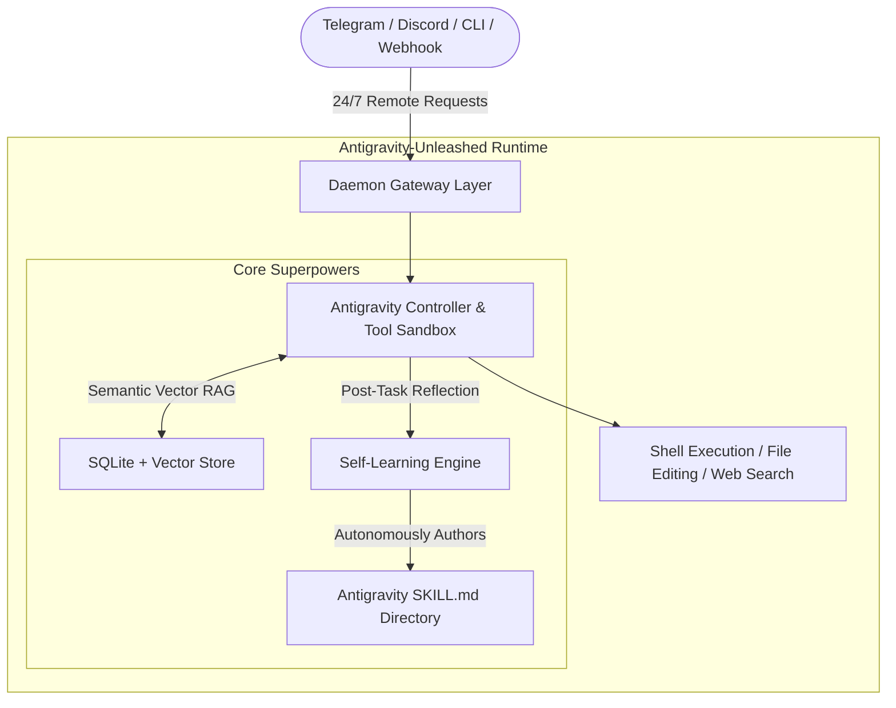

# 🚀 Antigravity-Unleashed

> **Transforming Google Antigravity into a 24/7 Autonomous, Self-Improving Agent System (Hermes & OpenClaw style)**

`antigravity-unleashed` wraps the reasoning and coding capabilities of Google Antigravity into an always-on, multi-channel daemon with cross-session semantic vector memory, multi-platform messaging gateways (Telegram, Discord, Webhooks), and autonomous self-evolution.

---

## 🌟 Key Architecture & Features



### 1. 🌐 24/7 Multi-Channel Gateways
- **Telegram Bot:** Chat with your agent on the go, receive live tool execution status, and approve commands remotely.
- **Discord Bot:** Add the agent to your team server or DM it for private pair programming.
- **Interactive CLI:** Beautiful rich terminal interface for fast local testing.
- **REST & Webhooks:** Trigger agent tasks from GitHub Actions, CI/CD pipelines, or cron schedulers.

### 2. 🧠 Persistent Cross-Session Vector Memory
- Automatically remembers past conversations, user preferences, and project facts.
- Performs semantic vector similarity search before every prompt to dynamically inject relevant context.

### 3. ✨ Autonomous Self-Evolution (Self-Authoring Skills)
- Post-task reflection loop evaluates completed workflows.
- Autonomously authors reusable `.agents/skills/<name>/SKILL.md` runbooks and helper scripts that persist across all future sessions.

### 4. 🪝 Native Antigravity Lifecycle Hook Integration
- Seamlessly mounts `.agents/hooks.json` to inject persistent memory (`PreInvocation`) and record task outcomes (`Stop`).

---

## 📦 Quick Start

### 1. Installation
Clone the repository and install dependencies:

```bash
git clone https://github.com/your-username/antigravity-unleashed.git
cd antigravity-unleashed
pip install -r requirements.txt
```

### 2. Configuration
Copy `config.yaml.example` to `config.yaml` and set your desired tokens:

```yaml
# config.yaml
model:
  provider: "gemini"
  model_name: "gemini-2.5-pro"
  api_key: "${GEMINI_API_KEY}"

gateways:
  cli:
    enabled: true
  telegram:
    enabled: true
    bot_token: "YOUR_TELEGRAM_BOT_TOKEN"
  discord:
    enabled: false
    bot_token: "YOUR_DISCORD_BOT_TOKEN"
```

### 3. Running the Daemon
Launch the 24/7 daemon:

```bash
python run.py
```

---

## 📁 Repository Structure

```text
antigravity-unleashed/
├── config.yaml                     # Active configuration
├── config.yaml.example             # Configuration template
├── requirements.txt                # Python dependencies
├── run.py                          # Main launch script
├── .agents/
│   ├── hooks.json                  # Antigravity lifecycle hooks (Memory + Reflection)
│   ├── rules/
│   │   └── autonomous-behavior.md  # Core operational rulebook
│   └── skills/                     # Self-authored & custom SKILL.md runbooks
├── data/
│   └── memory.sqlite               # Persistent SQLite & vector store
├── src/
│   ├── daemon.py                   # 24/7 background orchestrator
│   ├── config.py                   # Pydantic configuration loader
│   ├── core/
│   │   ├── engine.py               # Main agent execution loop
│   │   ├── tools.py                # Shell, file, search, and skill tools
│   │   └── reflection.py           # Self-learning & skill synthesis
│   ├── memory/
│   │   ├── store.py                # Persistent vector & metadata store
│   │   └── episodic.py             # Channel session histories
│   └── gateways/
│       ├── cli.py                  # Interactive terminal
│       ├── telegram_bot.py         # Telegram bot adapter
│       ├── discord_bot.py          # Discord bot adapter
│       └── rest_api.py             # FastAPI webhook & health endpoint
└── scripts/
    ├── hook_memory_inject.py       # PreInvocation hook handler
    └── hook_stop_reflect.py        # Stop hook handler
```

---

## 📄 License
MIT License
