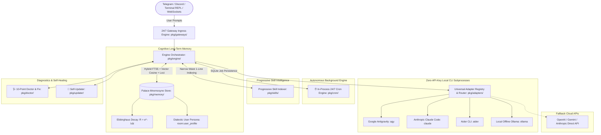

# 🏗️ Agent-Unleashed (`agt-ul`) System Architecture

`agent-unleashed` is engineered as an industrial-grade, single-binary Go daemon and CLI meta-harness designed to orchestrate local and remote AI coding agents with zero latency overhead.

---

## 🏛️ High-Level System Architecture

---

## ⚙️ Core Subsystem Breakdown

### 1. Ingress & Gateways (`pkg/gateways/`)
* **Terminal REPL (`pkg/gateways/cli.go`):** Interactive CLI with active driver badges, command router (`:doctor`, `:context`, `:verbose`, `:cron`, `:profile`, `:drivers`, `:memory`, `:skills`, `:clear`), and real-time bottom telemetry console.
* **WebSocket Streaming Hub (`pkg/gateways/websocket.go`):** Broadcasts bidirectional typed JSON frames on `ws://127.0.0.1:8080/ws` for web frontends, browser companions, and IDE sidecars.
* **Telegram Bot (`pkg/gateways/telegram.go`):** Non-blocking polling listener with interactive `InlineKeyboardMarkup` approval callback handlers (`[✅ Approve] [⛔ Deny]`).
* **Discord Bot (`pkg/gateways/discord.go`):** Mention and DM channel pairing with automated 1950-character markdown chunking.
* **REST API (`pkg/gateways/rest_api.go`):** High-performance HTTP server mounted on port `8080` for webhooks and CI/CD triggers.

### 2. Execution Engine & Tool Runner (`pkg/engine/`)
* **`Orchestrator`:** Handles prompt assembly, pre-invocation memory retrieval, skill index injection, subprocess execution via adapters, and post-invocation reflection.
* **`ToolRunner`:** Sandboxed execution engine providing file operations (`read_file`, `write_file`, `list_dir`, `delete_file`), memory storage, and system commands.

### 3. Pluggable Adapters (`pkg/adapters/`)
* **Unified Interface:** Standardized `CLIAdapter` Go contract requiring `Execute(ctx, prompt, workspaceDir) (*ExecutionResult, error)`.
* **Telemetry Extraction:** Automatically parses stdout/stderr from CLI runs into structured `ExecutionResult`:
  * `InputTokens`, `OutputTokens`, `ThinkingTokens`, `CacheReadTokens`, `TotalTokens`, `DurationSeconds`, `NumTurns`, and `ContextLimit`.

### 4. Palace-Mnemosyne Memory (`pkg/memory/`)
* **Pure Go SQLite:** Powered by `modernc.org/sqlite` (Zero CGO, zero external DLL dependencies).
* **FTS5 & Vector Hybrid RAG:** SQLite full-text search combined with normalized 384-dimensional cosine vector embeddings.
* **Mathematical Forgetting:** Ebbinghaus decay curve $R = e^{-\lambda \Delta t}$ with spaced-repetition reinforcement boosts.

### 5. Autonomous Cron Engine (`pkg/cron/`)
* **5-Part Cron Evaluator:** Evaluates minute, hour, day-of-month, month, day-of-week every 60 seconds on a dedicated background Goroutine.
* **Persistent SQLite Store:** Table `cron_jobs` records schedules, prompts, target channels, and last execution timestamps.

---

## 🔒 Security & Sandboxing Model

1. **Zero Third-Party Cloud Dependency:** Runs 100% locally on your machine.
2. **Local Credential Multiplexing:** Never exposes your Anthropic or Google session cookies or credentials; leverages existing authenticated local CLI sessions directly.
3. **Pure Go Binary:** Compiled into a single statically-linked binary (`agt-ul.exe`) with no Python virtualenvs or Node.js runtime bloat.
