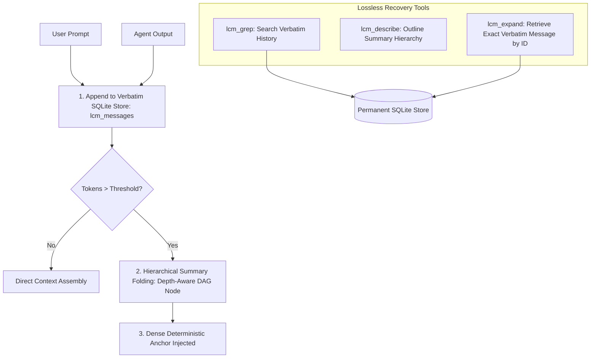

# 🧠 Lossless Context Management (LCM) Engine

> Native pure Go implementation of the **Lossless Context Management (LCM)** DAG architecture inspired by [stephenschoettler/hermes-lcm](https://github.com/stephenschoettler/hermes-lcm) for NousResearch Hermes Agent.

---

## 🎯 The Problem: Context Rot & Sliding-Window Amnesia

Standard agent frameworks rely on **lossy context compression**:
* When a conversation reaches the token limit, intermediate turns, code diffs, and earlier user constraints are permanently truncated.
* Basic summarizers discard exact variable names, hashes, compiler logs, and verbatim instruction nuances.

---

## ⚡ The Solution: Hierarchical DAG & Verbatim SQLite Persistence

`agent-unleashed` incorporates a native **DAG-based Lossless Context Management Engine (`pkg/lcm/`)**:



---

## 🛠️ Key Capabilities

1. **Permanent Verbatim Message Ledger:** Every single user and assistant turn is recorded with exact token metrics into `./data/lcm.sqlite`.
2. **Deterministic Summary DAG:** Automatically folds historical message runs into hierarchical depth-aware summary nodes without losing context anchors.
3. **Lossless Recovery Tools:**
   * **`lcm_grep` (`:lcm grep <query>`)**: Instant search across all historical turns across all sessions.
   * **`lcm_describe` (`:lcm describe`)**: High-level outline of total tokens, message counts, and DAG nodes.
   * **`lcm_expand` (`:lcm expand <id>`)**: Reconstructs and recalls the exact full verbatim message from compressed nodes on demand.
4. **Cross-Session Persistence:** Memory and DAG trees survive daemon restarts.

---

## 💻 CLI & REPL Commands

| Command | Description |
| :--- | :--- |
| **`agt-ul lcm`** | Display global LCM DAG stats and token compaction ratio |
| **`:lcm`** | (Inside REPL) Describe current session's DAG hierarchy |
| **`:lcm grep <query>`** | Search across all verbatim historical messages |
| **`:lcm expand <id>`** | Expand and print the complete verbatim message for a given ID |

---

## 🎛️ Configuration (`config.yaml`)

```yaml
lcm:
  enabled: true
  db_path: "./data/lcm.sqlite"
  token_threshold: 8000       # Triggers hierarchical DAG folding when exceeded
  auto_compress: true         # Automatically create summary nodes in background
```
